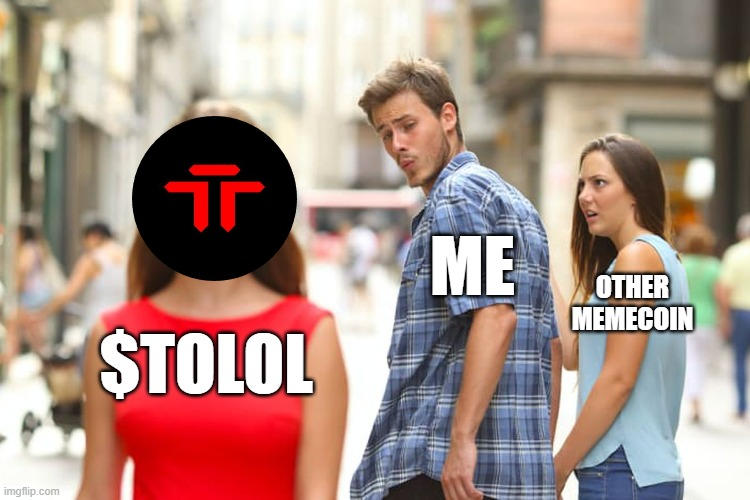

# 💢 About us

$TOLOL 💢 is a meme coin with no intrinsic value or expectation of financial return. There is no formal team or roadmap. the coin is completely useless and for entertainment purposes only.

<figure><figcaption></figcaption></figure>

#### Risks of Investing in $TOLOL 💢

**Lack of Intrinsic Value**

$TOLOL is explicitly described as a meme coin with no intrinsic value, meaning it does not offer any economic benefits or returns to its holders. The absence of intrinsic worth makes it an extremely risky investment, as its market value is purely speculative.

**No Financial Returns Expected**

The coin is created for entertainment purposes, with no expectation of financial return. Investing in $TOLOL with the hope of making money could result in significant financial loss, as its price could plummet to zero without warning.

**Lack of Formal Team or Roadmap**

Without a dedicated team or a clear roadmap, $TOLOL lacks direction and purpose. This raises serious sustainability concerns, as there is no one steering the project towards growth or adaptation in the rapidly changing cryptocurrency market.

**High Volatility**

Like many meme coins, $TOLOL is subject to extreme volatility. Such assets can experience massive price swings in very short periods, making them unsuitable for those with a low risk tolerance.

**Speculative Nature**

The value of $TOLOL is driven purely by speculation and social media hype, rather than fundamental value or utility. This makes it a highly speculative and risky investment, vulnerable to sudden drops in value if the hype dies down.

Investing in $TOLOL should be approached with extreme caution, understanding that it's akin to gambling rather than a traditional investment. Potential investors should only allocate funds that they are fully prepared to lose.

#### Potential Benefits of Investing in $TOLOL 💢

**Community Engagement and Entertainment**

Investing in $TOLOL can offer an engaging and entertaining community experience. Meme coins often have vibrant, active communities where members share jokes, memes, and engage in various social activities. This social aspect can be a fun and enjoyable experience, providing more than just financial interest.

**Educational Value**

For newcomers to the cryptocurrency market, starting with a low-stakes investment like $TOLOL can serve as an educational tool. It allows investors to learn about market dynamics, trading, and cryptocurrency handling without the high risk of significant financial loss.

**Potential for Short-Term Gains**

While highly speculative and risky, meme coins like $TOLOL can experience rapid price increases based on trends, media attention, or endorsements from high-profile individuals. Investors who are highly attuned to market sentiments and trends might find short-term trading opportunities, though this comes with a high level of risk and unpredictability.

**Diversification**

For those with a comprehensive investment portfolio, adding a small, speculative component like $TOLOL could potentially offer diversification benefits. While it should be a minimal part of an investment strategy, its uncorrelated nature to traditional assets could offer unique movements in a well-rounded portfolio.

**Supporting Innovation**

By investing in meme coins, even those created as a joke or without a clear purpose, investors indirectly support the broader ecosystem of blockchain and cryptocurrency innovation. It promotes a culture of creativity and experimentation, which is foundational to the development of groundbreaking technologies and applications in the industry.
